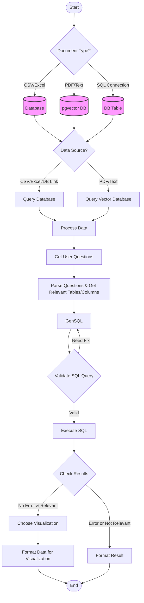
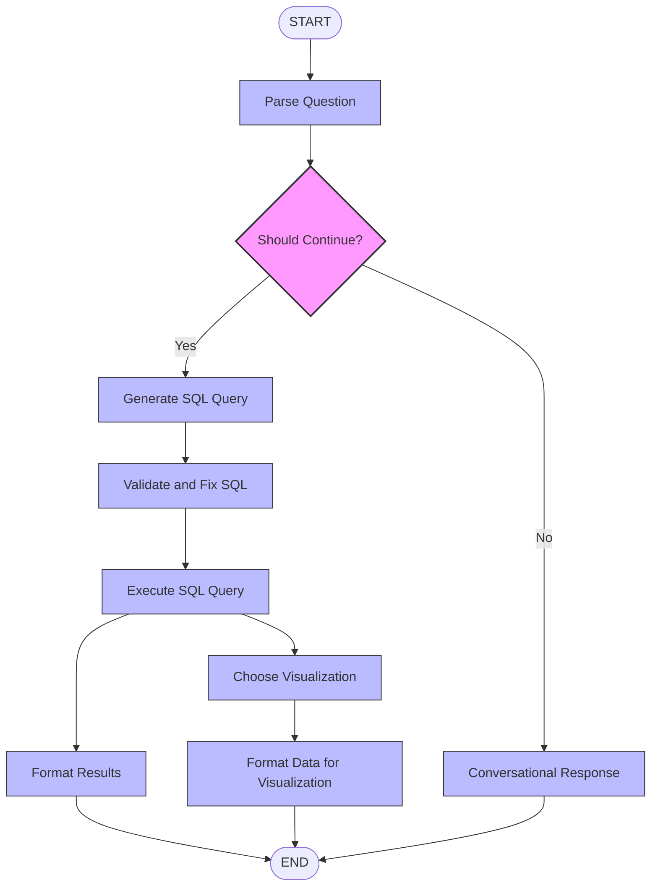
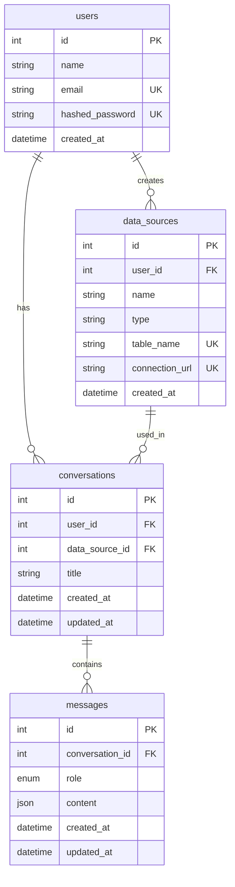

# LangGraph SQL Analysis Workflow

A state-based workflow system for processing natural language queries, generating SQL, and creating visualizations using LangGraph and LangChain.

## 🚀 Quick Start

### Prerequisites

- Docker & Docker Compose
- Git

### Start Project

```bash
# Clone the repository
git clone https://github.com/spandan114/LuminAI-Data-Analyst.git
cd lumin_ai

```

### Start Project
```bash
# Start the containers
docker compose up --build
```

### Remove Project

```bash
# Stop and remove containers
docker compose down
```

## Modules & Tools

- Python 3.8+
- LangGraph
- LangChain
- SQL Database (PostgreSQL recommended)

## ⚡ Features

- Natural language query processing
- Automated SQL generation and validation
- Dynamic visualization selection
- Fallback to conversational responses
- State-based workflow management


## 🔄 Workflow Architecture

##### High level flow


##### Lang graph flow
The system uses a state-based workflow to process queries and generate appropriate SQL or conversational responses:



## Database Schema 


## 🤝 Contributing

1. Fork the repository
2. Create your feature branch (`git checkout -b feature/AmazingFeature`)
3. Commit your changes (`git commit -m 'Add some AmazingFeature'`)
4. Push to the branch (`git push origin feature/AmazingFeature`)
5. Open a Pull Request

## 📄 License

This project is licensed under the MIT License - see the [LICENSE](LICENSE) file for details.
