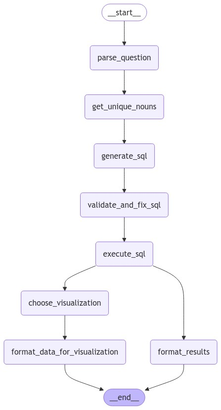

Agent flow:



Start Project:

```docker
docker compose up --build
```

Remove container:

```docker
docker compose down
```

```python
       # agent = SQLAgent(llm=llm)
        # state = {
        #     "question": "What percentage of orders are in each status?",
        #     "schema": schema
        # }
        # parse_question = agent.get_parse_question(state)
        # state["parsed_question"] = parse_question["parsed_question"]
        # sql_query = agent.generate_sql_query(state)
        # state["sql_query"] = sql_query["sql_query"]
        # validated_query = agent.validate_and_fix_sql(state)
        # print(validated_query["sql_query"])
        # query_result = db.execute_query(validated_query["sql_query"])
        # state["query_result"] = query_result
        # formatted_res = agent.format_results(state)
        # print("===== formatted_res ===== :", formatted_res)
        # choose_visualization = agent.choose_visualization(state)
        # print("===== choose_visualization ===== :", choose_visualization)
        # state["recommended_visualization"] = choose_visualization["recommended_visualization"]
        # formatted_visualization = agent.format_visualization_data(state)

        # return {
        #     "question": state["question"],
        #     "answer": formatted_res["answer"],
        #     "sql_query": validated_query["sql_query"],
        #     "choose_visualization": choose_visualization["recommended_visualization"],
        #     "formatted_visualization": formatted_visualization
        # }
```
