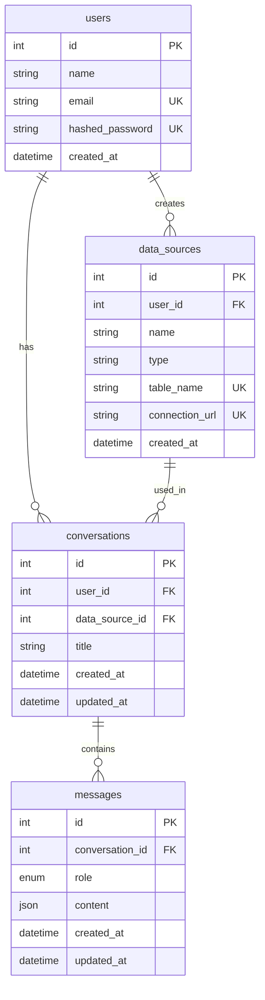

<p align="center">
  
</p>

LUMIN is an intelligent data analysis platform that transforms how you interact with your data. Using LLM, LUMIN enables you to ask analytical questions about your data in plain English and receive insights through beautiful visualizations and clear explanations.


## 🚀 Quick Start

### Prerequisites

- Docker & Docker Compose
- Git

### Clone Project

```bash
# Clone the repository
git clone https://github.com/spandan114/LuminAI-Data-Analyst.git
cd lumin_ai

```

### Start Project
```bash
# Start the containers
docker compose up --build
```

### Remove Project

```bash
# Stop and remove containers
docker compose down
```

## ⚡ Features

- 📂 Universal Data Connection: Seamlessly connect with multiple data sources:

    - CSV and Excel files
    - SQL Databases
    - PDF Documents (API Not integrated yet)
    - Text Files (API Not integrated yet)

- 🧠 Multiple LLM Support: Choose your preferred AI engine:

    - OpenAI (ChatGPT)
    - Groq
    - Hugging Face Models
    - Ollama (Self-hosted)
    - Easy to extend with new LLM providers

- 🤖 Natural Language Processing: Ask questions in plain English about your data

- 📊 Smart Visualizations: Automatically generates relevant charts and graphs

- 🔍 Intelligent Analysis: Provides deep insights and patterns in your data


## 🛠️ Tech Stack

### Frontend Modules

| Module | Description |
|--------|-------------|
| `@tanstack/react-query` | Powerful data synchronization for React |
| `chart.js` & `react-chartjs-2` | Rich data visualization library with React components |
| `react-hook-form` | Performant forms with easy validation |
| `react-router-dom` | Declarative routing for React applications |
| `react-toastify` | Toast notifications made easy |
| `recharts` | Composable charting library for React |
| `zustand` | Lightweight state management solution |
| `prismjs` | Syntax highlighting for code blocks |
| `axios` | Promise-based HTTP client |

### Backend Modules

| Module | Description |
|--------|-------------|
| `fastapi` | Modern, fast web framework for building APIs |
| `langchain` | Framework for developing LLM powered applications |
| `langgraph` | State management for LLM application workflows |
| `langchain-openai` | OpenAI integration for LangChain |
| `sqlalchemy` | SQL toolkit and ORM |
| `pgvector` | Vector similarity search for PostgreSQL |
| `pydantic` | Data validation using Python type annotations |
| `alembic` | Database migration tool |
| `pandas` | Data manipulation and analysis library |
| `passlib` | Password hashing library |
| `python-multipart` | Streaming multipart parser for Python |

### Development Tools

| Tool | Purpose |
|------|---------|
| `vite` | Next generation frontend tooling |
| `typescript` | JavaScript with syntax for types |
| `tailwindcss` | Utility-first CSS framework |
| `eslint` & `prettier` | Code linting and formatting |
| `autopep8` | Python code formatter |


## 🔄 Workflow Architecture

##### High level flow


##### Lang graph flow
The system uses a state-based workflow to process queries and generate appropriate SQL or conversational responses:


## Database Schema 


## 🤝 Contributing

1. Fork the repository
2. Create your feature branch (`git checkout -b feature_name`)
3. Commit your changes (`git commit -m 'Add some comment'`)
4. Push to the branch (`git push origin feature_name`)
5. Open a Pull Request

#### Features You Can Contribute
We welcome contributions! Here are some exciting features you can help implement:

**💭 Contextual Chat Enhancement:**
*Status:* Needs Implementation

- Implement context retrieval system
- Integrate pgvector for similarity search
- Add relevance scoring for context selection
- Create context window management
- Add context visualization for users

**📑 Document Analysis Integration:**
*Status:* Backend Ready, Needs Frontend Implementation
- Add functionality to upload PDF or Text document
- Integrate PDF and Text file analysis in the frontend

**⚙️ User Settings Dashboard:**
*Status:* Needs Implementation

- Profile management interface
- Password change workflow with validation
- Email update with verification
- LLM platform selection with configuration
- Model selection based on chosen platform


## 📄 License

This project is licensed under the MIT License - see the [LICENSE](LICENSE) file for details.
